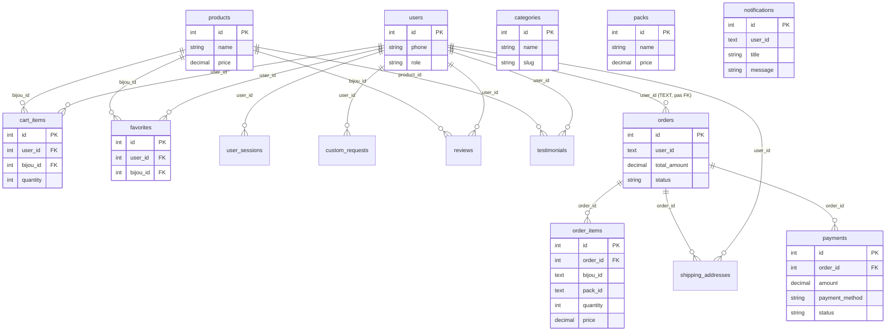

# Supabase — Structure des tables et liaisons (schéma public)

Document de référence pour le projet **inoxya-bijoux** : toutes les tables et leurs liaisons (clés étrangères).

---

## 1. Vue d’ensemble des liaisons (schéma relationnel)

```
┌─────────────┐       ┌─────────────┐       ┌──────────────┐
│   users     │       │  products   │       │  categories  │
│ id (PK)     │       │ id (PK)     │       │ id (PK)      │
└──────┬──────┘       └──────┬──────┘       └──────────────┘
       │                     │
       │    ┌────────────────┼────────────────┐
       │    │                │                │
       ▼    ▼                ▼                ▼
┌─────────────┐       ┌─────────────┐   ┌─────────────┐
│ cart_items  │       │  favorites │   │   reviews   │
│ user_id→users│       │ user_id→   │   │ user_id→    │
│ bijou_id→   │       │ bijou_id→  │   │ bijou_id→   │
│  products   │       │  products  │   │  products   │
└─────────────┘       └─────────────┘   └─────────────┘
       │
       ▼
┌─────────────┐
│user_sessions│
│ user_id→    │
│  users      │
└─────────────┘

┌─────────────┐       ┌─────────────┐
│   orders    │       │    packs    │
│ id (PK)     │       │ id (PK)     │
│ user_id     │       └─────────────┘
└──────┬──────┘
       │
       ├──────────────────────────────┐
       ▼                              ▼
┌─────────────┐                 ┌─────────────┐
│order_items │                 │  payments    │
│ order_id───┼──► orders        │ order_id───┼──► orders
│ bijou_id   │                 │             │
│ pack_id    │                 └─────────────┘
└─────────────┘

┌──────────────────┐    ┌─────────────┐
│ shipping_addresses│    │custom_requests│
│ user_id → users   │    │ user_id → users
│ order_id → orders │    └─────────────┘
└──────────────────┘

┌──────────────────┐
│   testimonials   │
│ user_id → users  │
│ product_id →     │
│   products       │
└──────────────────┘
```

---

## 2. Diagramme Mermaid (ERD)

À afficher dans un lecteur Markdown (VS Code, GitHub, etc.) pour voir le schéma visuel.



---

## 3. Liste des liaisons (clés étrangères)

| Table              | Colonne   | Référence        | Contrainte (ON DELETE) |
|--------------------|-----------|------------------|-------------------------|
| **order_items**    | order_id  | orders(id)       | CASCADE                 |
| **payments**       | order_id  | orders(id)       | CASCADE                 |
| **cart_items**     | user_id   | users(id)        | CASCADE                 |
| **cart_items**     | bijou_id  | products(id)     | CASCADE                 |
| **favorites**     | user_id   | users(id)        | CASCADE                 |
| **favorites**     | bijou_id  | products(id)     | CASCADE                 |
| **user_sessions** | user_id   | users(id)        | CASCADE                 |
| **custom_requests**| user_id   | users(id)        | SET NULL                |
| **reviews**       | user_id   | users(id)        | SET NULL                |
| **reviews**       | bijou_id  | products(id)     | CASCADE                 |
| **shipping_addresses** | user_id  | users(id)        | CASCADE                 |
| **shipping_addresses** | order_id | orders(id)       | SET NULL                |
| **testimonials**   | user_id   | users(id)        | SET NULL                |
| **testimonials**   | product_id| products(id)     | SET NULL                |

**Note :** La table **orders** a une colonne `user_id` (TEXT) sans FK vers `users` dans le schéma actuel (commandes invité possibles).

---

## 4. Liaisons « Admin » : tout passe par la table **users**

Il n’y a **pas de table `admin`** séparée. Les admins sont des **users** avec `role = 'admin'` (ou `'moderator'`). Toutes les liaisons « admin » sont donc les tables qui référencent **users(id)**.

**Schéma des tables liées à l’admin (via users) :**

```
                    ┌─────────────────┐
                    │     users       │
                    │ id (PK)         │
                    │ phone, role     │  ← role = 'admin' pour les comptes admin
                    └────────┬────────┘
                             │
     ┌───────────────────────┼───────────────────────┐
     │                       │                       │
     ▼                       ▼                       ▼
┌──────────────┐    ┌──────────────┐    ┌──────────────────┐
│user_sessions │    │ cart_items   │    │ custom_requests  │
│ user_id →    │    │ user_id →    │    │ user_id →       │
│  users       │    │  users       │    │  users          │
└──────────────┘    └──────────────┘    └──────────────────┘
     │                       │                       │
     ▼                       ▼                       ▼
┌──────────────┐    ┌──────────────┐    ┌──────────────────┐
│  favorites   │    │   reviews    │    │ shipping_addresses│
│ user_id →    │    │ user_id →    │    │ user_id →        │
│  users       │    │  users       │    │  users           │
└──────────────┘    └──────────────┘    └──────────────────┘
                             │
                             ▼
                    ┌──────────────────┐
                    │   testimonials   │
                    │ user_id → users  │
                    └──────────────────┘
```

**Tables que l’admin utilise mais sans FK vers users :**  
orders, order_items, payments, products, packs, categories, notifications, settings — l’admin les consulte ou les modifie, mais elles ne pointent pas obligatoirement vers un user (ex. commandes invité, produits créés sans `created_by`). Aucune liaison supplémentaire à ajouter pour l’admin.

**Résumé :** Toutes les liaisons « admin » existent déjà via les FK vers **users**. Aucune table ou contrainte supplémentaire n’est nécessaire.

---

## 5. Structure détaillée des tables principales (checkout + catalogue)

### products
| Colonne        | Type           | Contraintes |
|----------------|----------------|-------------|
| id             | SERIAL         | PRIMARY KEY |
| name           | TEXT           | NOT NULL    |
| name_ar        | TEXT           |             |
| description    | TEXT           |             |
| price         | DECIMAL(10,2)  | NOT NULL    |
| original_price | DECIMAL(10,2)  |             |
| category       | TEXT           | NOT NULL    |
| stock          | INTEGER        | DEFAULT 0   |
| is_active      | BOOLEAN        | DEFAULT true|
| image_url      | TEXT           |             |
| images         | TEXT           | DEFAULT '[]'|
| is_featured    | BOOLEAN        | DEFAULT false |
| created_at     | TIMESTAMP      | DEFAULT NOW() |
| updated_at     | TIMESTAMP      | DEFAULT NOW() |

### categories
| Colonne     | Type      | Contraintes   |
|-------------|-----------|---------------|
| id          | SERIAL    | PRIMARY KEY   |
| name        | TEXT      | NOT NULL UNIQUE |
| slug        | TEXT      | NOT NULL UNIQUE |
| description | TEXT      |               |
| image_url   | TEXT      |               |
| created_at  | TIMESTAMP | DEFAULT NOW() |

### packs
| Colonne     | Type          | Contraintes   |
|-------------|---------------|---------------|
| id          | SERIAL        | PRIMARY KEY   |
| name        | TEXT          | NOT NULL      |
| slug        | TEXT          | NOT NULL UNIQUE |
| description | TEXT          |               |
| price       | DECIMAL(10,2) | NOT NULL      |
| image_url   | TEXT          |               |
| is_featured | BOOLEAN       | DEFAULT false |
| created_at  | TIMESTAMP     | DEFAULT NOW() |

### orders
| Colonne          | Type          | Contraintes   |
|------------------|---------------|---------------|
| id               | SERIAL        | PRIMARY KEY   |
| user_id          | TEXT          | (optionnel)   |
| total_amount     | DECIMAL(10,2) | NOT NULL      |
| status           | TEXT          | DEFAULT 'pending' |
| shipping_address | TEXT          |               |
| phone            | TEXT          |               |
| notes            | TEXT          |               |
| created_at       | TIMESTAMP     | DEFAULT NOW() |

### order_items (liaison → orders)
| Colonne   | Type          | Contraintes        |
|-----------|---------------|--------------------|
| id        | SERIAL        | PRIMARY KEY        |
| order_id  | INTEGER       | NOT NULL, FK → orders(id) ON DELETE CASCADE |
| bijou_id  | TEXT          |                    |
| pack_id   | TEXT          |                    |
| quantity  | INTEGER       | NOT NULL          |
| price     | DECIMAL(10,2) | NOT NULL          |
| created_at| TIMESTAMP     | DEFAULT NOW()     |

### payments (liaison → orders)
| Colonne        | Type          | Contraintes        |
|----------------|---------------|--------------------|
| id             | SERIAL        | PRIMARY KEY        |
| order_id       | INTEGER       | NOT NULL, FK → orders(id) ON DELETE CASCADE |
| amount         | DECIMAL(10,2) | NOT NULL           |
| payment_method | TEXT          | NOT NULL           |
| status         | TEXT          | DEFAULT 'pending'  |
| transaction_id | TEXT          |                    |
| created_at     | TIMESTAMP     | DEFAULT NOW()      |
| updated_at     | TIMESTAMP     | DEFAULT NOW()      |

### users
| Colonne      | Type      | Contraintes     |
|--------------|-----------|-----------------|
| id           | SERIAL    | PRIMARY KEY     |
| phone        | TEXT      | UNIQUE NOT NULL |
| password_hash| TEXT      | NOT NULL        |
| first_name   | TEXT      |                 |
| last_name    | TEXT      |                 |
| role         | TEXT      | NOT NULL DEFAULT 'user' |
| created_at   | TIMESTAMP | DEFAULT NOW()   |
| updated_at   | TIMESTAMP | DEFAULT NOW()   |

### cart_items (liaisons → users, products)
| Colonne   | Type      | Contraintes                    |
|-----------|-----------|--------------------------------|
| id        | SERIAL    | PRIMARY KEY                    |
| user_id   | INTEGER   | FK → users(id) ON DELETE CASCADE |
| bijou_id  | INTEGER   | FK → products(id) ON DELETE CASCADE |
| quantity  | INTEGER   | DEFAULT 1                      |
| created_at| TIMESTAMP | DEFAULT NOW()                 |
| UNIQUE(user_id, bijou_id) | | |

### favorites (liaisons → users, products)
| Colonne   | Type      | Contraintes                    |
|-----------|-----------|--------------------------------|
| id        | SERIAL    | PRIMARY KEY                    |
| user_id   | INTEGER   | FK → users(id) ON DELETE CASCADE |
| bijou_id  | INTEGER   | FK → products(id) ON DELETE CASCADE |
| created_at| TIMESTAMP | DEFAULT NOW()                 |
| UNIQUE(user_id, bijou_id) | | |

### notifications
| Colonne    | Type      | Contraintes   |
|------------|-----------|---------------|
| id         | SERIAL    | PRIMARY KEY   |
| user_id    | TEXT      |               |
| title      | TEXT      | NOT NULL      |
| message    | TEXT      | NOT NULL      |
| type       | TEXT      | DEFAULT 'info'|
| is_read    | INTEGER   | DEFAULT 0     |
| action_url | TEXT      |               |
| created_at | TIMESTAMP | DEFAULT NOW() |

---

## 6. Afficher les liaisons dans Supabase Table Editor

Pour que les **relations** (liens entre tables) s’affichent correctement dans l’interface Supabase (Table Editor / schéma) :

1. **Vérifier les orphelins** (éviter d’ajouter une FK sur des lignes invalides) :
   ```bash
   npx tsx scripts/checkout-orphans-verify.ts
   ```
2. **Ajouter les FK manquantes** (order_items → orders, payments → orders) si ce n’est pas déjà fait :
   - Ouvrir **Supabase → SQL Editor**.
   - Exécuter le contenu du fichier **`scripts/supabase-add-fk-checkout.sql`** (aucune suppression de données).

Après exécution, les tables **order_items** et **payments** afficheront le lien vers **orders** dans l’interface (colonnes reliées).

---

*Référence : schéma `public`, projet inoxya-bijoux.*
